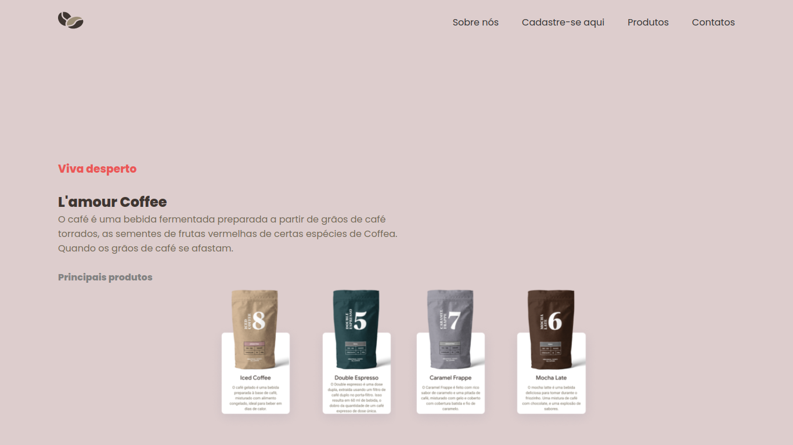

<h1 align="center">
  Home

</h1>

## 💻 The Project

Esse projeto foi desenvolvido durante a cadeira de Projeto e prática, oferecida pelo curso de Informática para Internet - IFPE , durante Março 18-31, 2021. 

## 🧪 Description

A Lamour Coffee é uma cafeteria virtual, direcionada para todos os amantes de café que gostam de facilidade e praticidade na hora de comprar o seu café favorito.

## 🚀 Iniciando o projeto 

Clone o projeto e acesse a pasta

```bash
$ git clone https://github.com/maeduarda/lamour-coffee-cafeteria.git && cd lamour-coffee-cafeteria
```


Siga os passos abaixo
```bash
# Install the dependencies
$ npm

# Start the project
#ou
$ npm start
```

Abra [http://localhost:3333](http://localhost:3333) com seu navegador para ver o resultado.

---
<p align="center">Criado com 💜 por Maria Eduarda</p>
 
